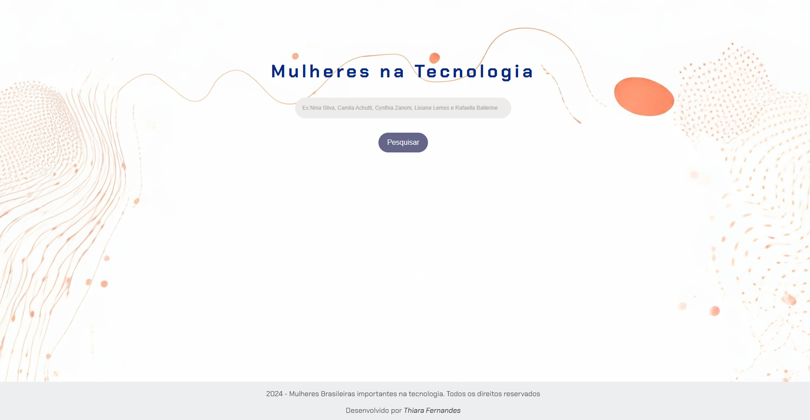
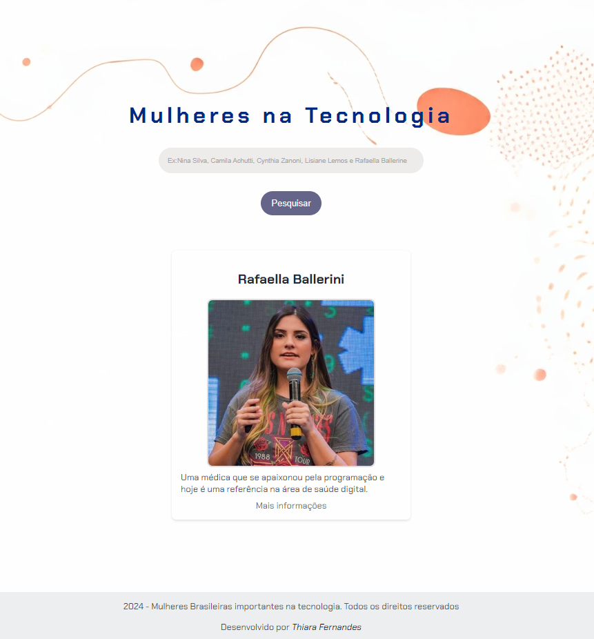

# Mulheres na Tecnologia

Este projeto celebra as conquistas e a presença de mulheres brasileiras na área da tecnologia, apresentando uma plataforma que permite pesquisar e conhecer mais sobre grandes personalidades que impactam o setor.

## 📚 Objetivo

O objetivo do projeto é destacar e homenagear mulheres que fizeram e continuam fazendo a diferença na área da tecnologia, promovendo a representatividade e inspirando futuras gerações.

## 🚀 Tecnologias Utilizadas

- **HTML**: para estruturar a página.
- **CSS**: para estilização e layout responsivo.
- **JavaScript**: para adicionar a interatividade, como a busca e exibição das informações.

## 🖥️ Como Funciona

1. **Pesquisar**: No campo de busca, digite o nome ou parte do nome de uma personalidade, por exemplo, "Nina Silva" ou "Camila".
2. **Resultados**: Os resultados da pesquisa são exibidos logo abaixo, mostrando o nome, uma breve descrição e um link para mais informações.

## 📝 Lista de algumas Mulheres em Destaque

- **Nina Silva**: Fundadora do Movimento Black Money e uma das 100 afrodescendentes mais influentes do mundo.
- **Camila Achutti**: Empreendedora e fundadora da Mastertech, pioneira na educação em tecnologia.
- **Cynthia Zanoni**: Promotora da diversidade na tecnologia.
- **Lisiane Lemos**: Referência em liderança e empoderamento feminino.
- **Rafaella Ballerini**: Médica e referência em saúde digital.

## ✨ Importância da Representatividade

A presença de mulheres na tecnologia é fundamental para a inovação e inclusão. Este projeto não apenas destaca essas mulheres incríveis, mas também serve como inspiração para que mais mulheres sigam carreiras na tecnologia, promovendo um ambiente mais diversificado e igualitário.

## 📸 Demonstração

## 🔗 Acesso ao Projeto
[Clique aqui para visualizar o projeto](https://thiarafernandes.github.io/mulheres-na-tecnologia/)

## 👩‍💻 Desenvolvido por

[Thiara Fernandes](https://github.com/ThiaraFernandes) - Apaixonada por tecnologia. Atualmente, estou estudando programação e desenvolvendo projetos que incentivam a representatividade feminina na área de tecnologia.

